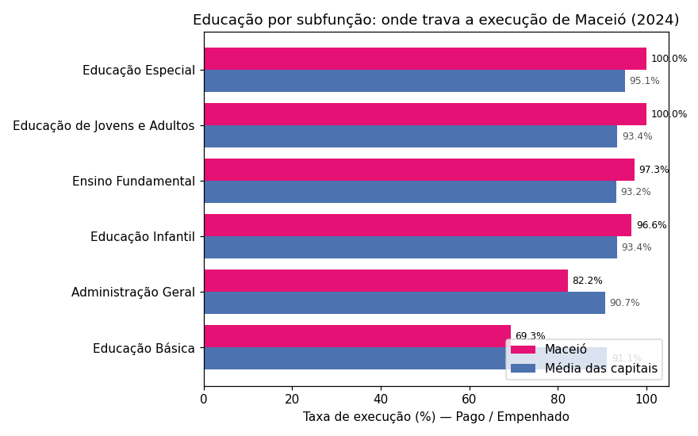

# Análise de despesas por função das capitais brasileiras

Solução para o desafio técnico de estágio em Análise de Dados da Sefaz Maceió.
O material bruto são seis anos de despesas municipais declaradas ao Siconfi
(relatório Despesas por Função, Anexo I-E, escopo Capitais), e a tarefa
central é medir a distância entre despesa **empenhada** e despesa **paga**,
função a função, nas 26 capitais brasileiras.

**Se você só tem um minuto:** Maceió executa 92,4% do que empenha (18ª de 26
em 2024) — um número mediano que desmonta quando aberto por área. A cidade
está entre as melhores do país em Saúde (97,4%, 5ª posição) e, ao mesmo
tempo, carrega o pior desvio de todo o conjunto de dados em Habitação: pagou
30% do empenhado, contra 85,2% da média das demais capitais. Em Educação, o
aparente problema geral (85,5% de execução) se revela concentrado: quatro das
seis subfunções executam acima da média nacional — o gargalo mora em duas
rubricas específicas, que juntas seguram R$ 104,4 milhões.

---

## As três perguntas que guiaram o trabalho

1. **Quem paga o que promete?** Ranking de execução financeira
   (pago ÷ empenhado × 100) entre as 26 capitais.
2. **Onde Maceió destoa das demais — para melhor e para pior?** Comparação
   função a função contra a média das capitais.
3. **O que dá para afirmar sobre 2025**, um ano em que só 11 das 26 capitais
   declararam dados?

## Para rodar

```bash
pip install -r requirements.txt

python scripts/extrair_dados.py      # abre os 6 zips por código
python scripts/consolidar_dados.py   # trata e une tudo num Parquet
python scripts/validar_dados.py      # 6 testes de integridade da base
python scripts/analise.py            # imprime os indicadores no terminal
python scripts/gerar_graficos.py     # exporta as 6 figuras
```

O texto completo com os achados fica em
[`analise/relatorio_analise.md`](analise/relatorio_analise.md); as figuras,
em `analise/graficos/`.

```text
dados_compactos/     zips originais do desafio, sem alteração
dados_extraidos/     um finbra.csv por ano, gerados pelo primeiro script
dados_consolidados/  consolidado.parquet — a base única de 50.334 linhas
scripts/             os cinco scripts acima
analise/             relatório e figuras
```

## Do zip ao Parquet: as decisões de tratamento

**O CSV do Siconfi não é um CSV comum.** A leitura só funciona declarando
quatro coisas de uma vez: separador `;`, três linhas de metadados a pular
antes do cabeçalho, codificação `latin-1` (sem isso, "Saúde" vira lixo) e
vírgula como separador decimal. Tudo isso está fixado no
`consolidar_dados.py`.

**O ano não existe dentro do arquivo.** Cada `finbra.csv` só sabe seu ano
pela pasta onde o zip estava. A extração registra isso — e busca os zips por
padrão (`*.zip`), não por nome, porque o arquivo de 2020 carrega um `(1)` no
nome que os demais não têm.

**A coluna `Conta` mistura quatro coisas diferentes.** Funções ("10 -
Saúde"), subfunções ("10.301 - Atenção Básica"), agregados residuais ("FU10 -
Demais Subfunções") e linhas de total geral. Somar tudo junto conta o mesmo
real duas vezes. Cada linha recebe uma etiqueta (`tipo_conta`) na
consolidação, e toda consulta filtra pela etiqueta certa.

**Por que Parquet, e por que DuckDB em cima dele?** O Parquet congela o
resultado do tratamento — tipos numéricos preservados, arquivo compacto,
leitura instantânea — para nunca mais repetir o parsing dos seis CSVs. O
DuckDB consulta esse arquivo diretamente em SQL, o que deixa as agregações
condicionais (somar empenhado e pago em colunas separadas na mesma passada)
mais legíveis do que o equivalente em pandas. Para 50 mil linhas, pandas
bastaria; a escolha é por clareza e por um fluxo que aguenta a série
histórica crescer.

## A base passa em seis testes antes de qualquer análise

O `validar_dados.py` não deixa a análise começar em cima de base quebrada.
Ele verifica: os seis anos presentes; 26 capitais em cada ano completo;
nenhum valor nulo após a conversão numérica; nenhuma linha sem classificação;
nenhuma duplicata; e — o teste mais forte — o **fechamento contábil**: a soma
das subfunções reproduz o total da própria função em todas as 12.813
combinações de ano, capital, função e estágio, com diferença de R$ 0,00.

## O que os dados mostram

### A média engana

A execução geral das capitais em 2024 vai de 86,4% (Natal) a 98,4% (Belém).
Maceió, com 92,4%, parece apenas mediana — mas essa é exatamente a leitura
que os recortes seguintes desmentem. Dos R$ 5,09 bilhões que a cidade
empenhou, R$ 385 milhões terminaram o ano sem pagamento.


### Habitação: o ponto mais fora da curva de todo o dataset

Nenhuma outra combinação de capital e função se afasta tanto do padrão:
Maceió empenhou R$ 2,2 milhões em Habitação em 2024 e pagou R$ 0,6 milhão —
**30% de execução, contra 85,2% da média** das capitais. A base mostra o
tamanho do represamento com precisão; a causa (contratos? cronograma de
obras? restos de anos anteriores?) está fora do alcance destes dados, e o
relatório trata isso como pergunta em aberto, não como conclusão.

### Educação: um problema com endereço

A execução de 85,5% (3ª pior do país) e o gasto de R$ 716 por habitante
(2ª posição mais baixa, atrás apenas de Belém — Vitória paga R$ 2.232/hab)
sugeririam um problema difuso. A abertura por subfunção mostra o contrário:

| Subfunção | Maceió | Média das 26 | Não pago (R$ mi) |
| --- | ---: | ---: | ---: |
| Educação Básica | 69,3% | 91,1% | 62,6 |
| Administração Geral | 82,2% | 90,7% | 41,8 |
| Educação Infantil | 96,6% | 93,4% | 1,7 |
| Ensino Fundamental | 97,3% | 93,2% | 8,1 |
| Educação Especial | 100,0% | 95,1% | 0,0 |
| Educação de Jovens e Adultos | 100,0% | 93,4% | 0,0 |

Quatro subfunções acima da média nacional; duas rubricas concentrando
R$ 104,4 dos R$ 116,4 milhões não pagos. Uma investigação de causa saberia
exatamente por onde começar.



### Saúde: de retardatária a empatada com a média

No gasto per capita pago em Saúde, Maceió rodou 2020–2022 cerca de 15%
abaixo da média das capitais, cruzou a linha em 2023 e fechou 2024 em
R$ 1.314,67 por habitante — praticamente a média (R$ 1.348,42). Na taxa de
execução da função, 97,4%, quinta melhor do país. Dentro da Saúde, 58,5% do
pago vai para Assistência Hospitalar e Ambulatorial e 27,5% para Atenção
Básica.


### 2025: comparar só quem declarou

Com 11 de 26 capitais na base, qualquer média de 2025 mede mudança de
amostra, não de gasto. A saída foi um recorte pareado: as mesmas 11
declarantes, em 2024 e em 2025. Nesse painel, São Luís lidera as altas de
per capita (+9,9%) e Rio Branco as quedas (−8,1%). Maceió não declarou 2025
até a data desta análise — para um órgão fazendário, o próprio atraso é
informação.


## Colunas da base consolidada

| Coluna | Conteúdo |
| --- | --- |
| `ano` | Exercício, derivado da pasta de origem do zip |
| `capital` / `instituicao` | Nome curto e nome completo da prefeitura |
| `cod_ibge` / `uf` | Identificação do município |
| `populacao` | População declarada no Siconfi, por ano |
| `estagio_despesa` | Empenhada, liquidada, paga ou restos a pagar |
| `conta_original` | Texto bruto da coluna Conta |
| `tipo_conta` | Etiqueta criada no tratamento: funcao, subfuncao, total_agregado ou demais_subfuncoes |
| `codigo_funcao` / `funcao_nome` | Função orçamentária (2 dígitos) |
| `codigo_subfuncao` / `subfuncao_nome` | Subfunção (5 dígitos), quando houver |
| `identificador_conta` | Código técnico interno do Siconfi |
| `valor` | Valor em reais |

## Até onde esta análise vai — e onde ela para

- Os valores são **nominais**. Parte do crescimento 2020–2024 é inflação;
  trazer a série a preços de hoje (IPCA) é o próximo passo natural.
- A **população declarada mudou de metodologia no meio da série**: entre
  2023 e 2024, todas as 26 capitais tiveram revisões bruscas (de −16% a
  +11%), provável efeito do Censo 2022. Qualquer per capita que cruze esses
  dois anos carrega esse ruído — inclusive os desta análise.
- A taxa de execução descreve, não julga: pagar menos do que se empenhou
  pode ter dezenas de causas legítimas que a base não registra.
- O mergulho por subfunção cobriu Saúde e Educação; Habitação, justamente o
  maior desvio encontrado, é a candidata óbvia à próxima rodada.

## Tropeços que viraram aprendizado

O primeiro susto foi o nome do arquivo de 2020 — um `(1)` sobrando que
quebraria qualquer caminho fixo; a extração por padrão nasceu daí, antes
mesmo do primeiro erro acontecer. O segundo foi entender que a linha
"Despesas Exceto Intraorçamentárias" não é uma despesa: é a soma de todas as
outras, disfarçada de linha comum — a etiquetagem da coluna `Conta` existe
para nunca somá-la junto. E o terceiro veio do próprio ambiente de trabalho:
o script de validação usava símbolos Unicode nas mensagens e o console do
Windows (cp1252) se recusava a imprimi-los — o mesmo tipo de conflito de
codificação dos CSVs, só que na direção oposta. Trocar por marcadores em
texto puro resolveu, e deixou a lição de que encoding é problema de entrada
**e** de saída.
