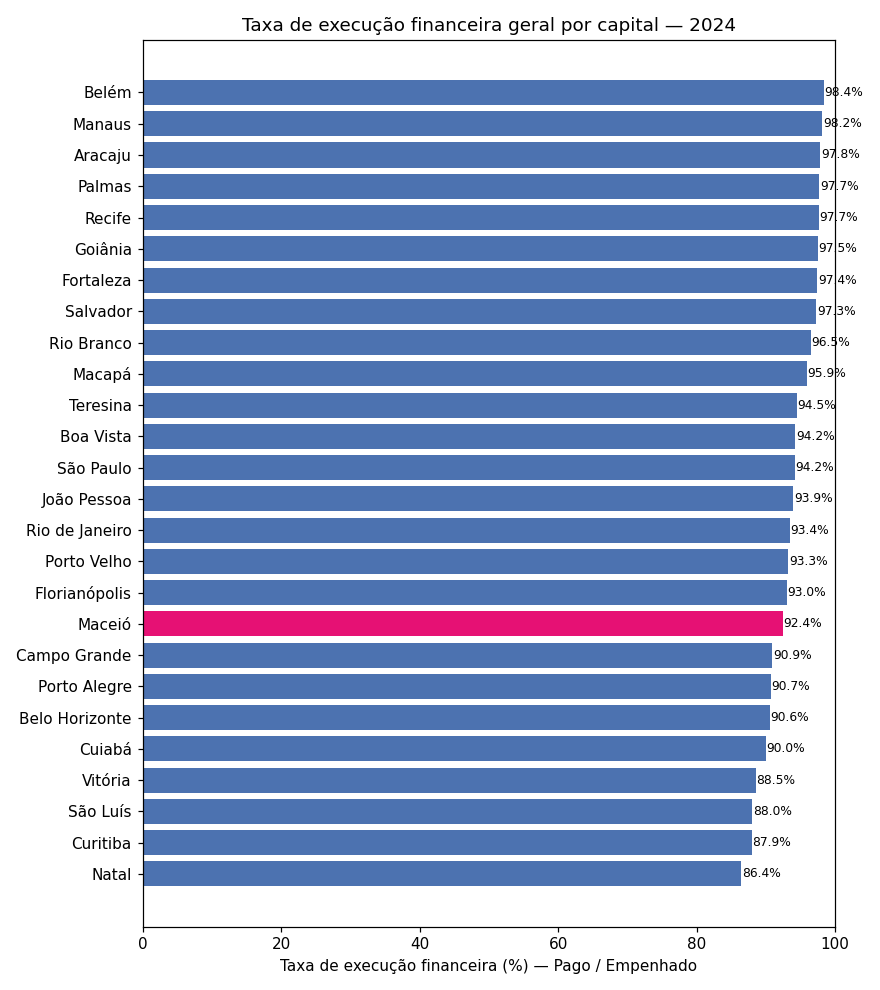
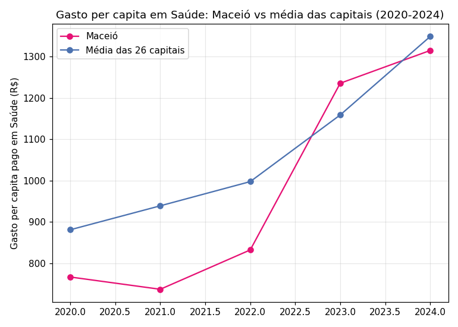
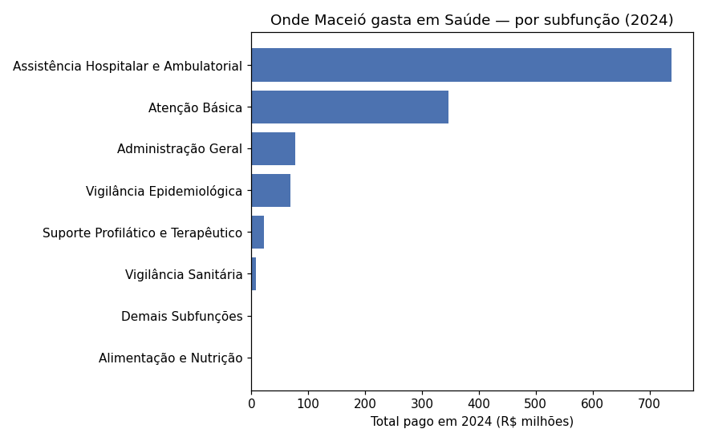
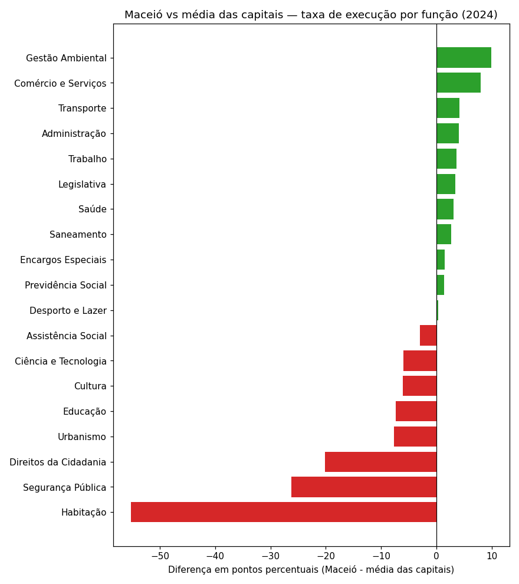
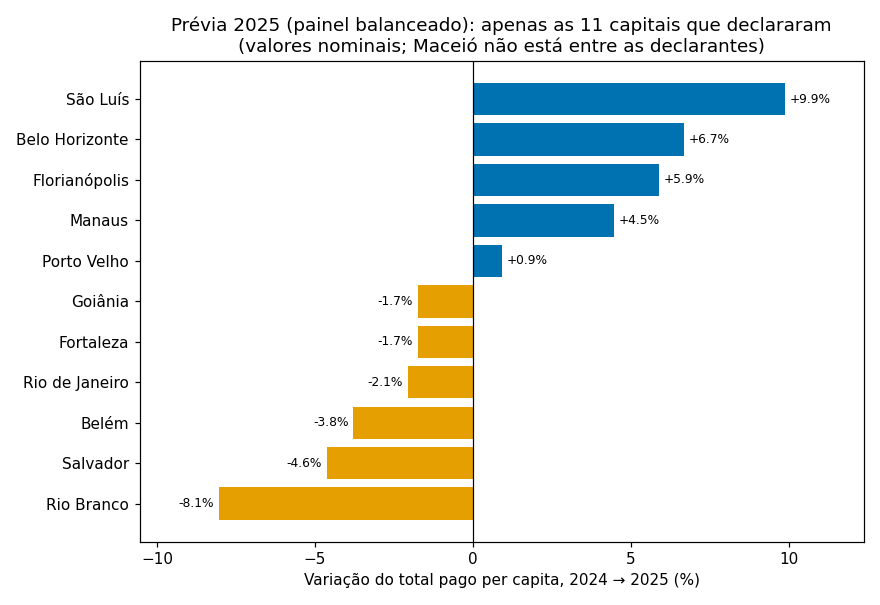

# Relatório de Análise — FINBRA Capitais 2020-2025

Este relatório é para comparar como as capitais brasileiras
executam suas despesas por função, com foco em **Empenhado × Pago**, e situar
Maceió nesse cenário.

Todos os números abaixo saem de consultas SQL rodadas com DuckDB direto sobre
`dados_consolidados/consolidado.parquet` (ver `scripts/analise.py` e
`scripts/gerar_graficos.py` para reproduzir).

---

## 0. Antes de tudo: nem todo ano é comparável

| Ano | Capitais que reportaram |
|---|---|
| 2020–2024 | 26 / 26 |
| 2025 | 11 / 26 |

**2025 foi excluído das comparações gerais entre capitais e das séries
temporais** — com menos da metade das capitais reportando, qualquer média ou
ranking ficaria distorcido. As análises de evolução temporal usam 2020-2024.
A única exceção é a **prévia com painel balanceado** da seção 8, que compara
2024 × 2025 apenas dentro das mesmas 11 capitais declarantes.

---

## 1. Taxa de execução financeira geral (Pago ÷ Empenhado) — 2024

- A taxa geral das 26 capitais varia de **86,4% (Natal)** a **98,4% (Belém)** —
  uma diferença de 12 pontos percentuais entre a melhor e a pior execução.
- **Maceió está em 92,4%**, na metade de baixo da tabela (18ª colocada), acima de
  capitais como Curitiba (87,9%) e Natal (86,4%), mas abaixo da maioria das
  capitais do Norte/Nordeste (Belém, Manaus, Aracaju, Recife, Fortaleza, todas
  acima de 97%).
- Isso significa que, do total empenhado por Maceió em 2024 (R$ 5,08 bi), cerca
  de **R$ 385 milhões (7,6%)** ficaram como restos a pagar — comprometidos, mas
  não desembolsados no ano.

---

## 2. Empenhado × Pago em Saúde e Educação

Em **Saúde**, Maceió executa bem: **97,4%**, a 5ª melhor taxa entre as 26
capitais, à frente de nomes grandes como São Paulo (96,1%) e Rio de Janeiro
(92,8%).

Em **Educação**, o quadro se inverte: Maceió executa **85,5%**, entre as piores
(3ª pior), só à frente de São Luís e Natal. A diferença de ~12 p.p.
entre a execução de Saúde e Educação dentro da própria Maceió sugere que o
gargalo não é generalizado — é mais concentrado em Educação.

---

## 3. Gasto per capita: o tamanho da cidade muda a leitura

Comparar valores absolutos entre São Paulo (12,2 milhões de habitantes) e
Vitória (330 mil) não diz muita coisa. Em **gasto per capita pago**:

- **Saúde**: Maceió paga **R$ 1.314/habitante**, próximo da mediana das
  capitais — bem atrás de Belo Horizonte (R$ 2.253) e Teresina (R$ 2.003), mas
  à frente de Salvador, Rio de Janeiro e Manaus.
- **Educação**: Maceió paga **R$ 716/habitante**, entre as **4 mais baixas**
  das 26 capitais — bem distante de Vitória (R$ 2.232) e São Paulo (R$ 1.828).

Isso reforça o ponto acima: o per capita baixo em Educação não é só uma questão
de execução (Empenhado x Pago) — o **valor empenhado por habitante** já nasce
menor do que em outras capitais.

---

## 4. Evolução 2020-2024: Maceió está alcançando a média em Saúde

| Ano | Maceió (R$/hab) | Média das capitais (R$/hab) |
|---|---:|---:|
| 2020 | 766,94 | 881,20 |
| 2021 | 737,29 | 939,08 |
| 2022 | 832,41 | 997,61 |
| 2023 | 1.235,46 | 1.158,78 |
| 2024 | 1.314,67 | 1.348,42 |

Maceió estava ~15% abaixo da média das capitais em 2020-2022, mas em **2023
ultrapassou a média** e se manteve muito próxima dela em 2024 (queda de apenas
~2,5%). O salto entre 2022 e 2023 (+48%) é o ponto de maior atenção — vale
investigar se foi um reajuste orçamentário pontual, inflação da saúde
pós-pandemia, ou mudança de política.

---

## 5. Onde Maceió gasta em Saúde

Em 2024, do total pago em Saúde por Maceió:
- **58,5%** foi para **Assistência Hospitalar e Ambulatorial**
- **27,5%** foi para **Atenção Básica**
- Os **14% restantes** se dividem entre Administração Geral (6,1%), Vigilância
  Epidemiológica (5,4%) e itens menores.

A concentração em atenção hospitalar (mais cara e reativa) em relação à atenção
básica (mais barata e preventiva) é um padrão comum entre capitais, mas também
um indicador clássico de política de saúde a se monitorar ano a ano.

---

## 6. Onde as capitais mais deixam para "restos a pagar"

Ranking (média entre as 26 capitais) do % do valor empenhado que **não** virou
pagamento no ano:

| Posição | Função | % médio não pago |
|---|---|---:|
| 1º | Agricultura | 16,2% |
| 2º | Habitação | 14,8% |
| 3º | Comércio e Serviços | 13,6% |
| 4º | Saneamento | 12,8% |
| ... | ... | ... |
| Saúde | | 5,8% |
| Educação | | 7,1% |
| Previdência Social (menor) | | 1,4% |

Funções de investimento/infraestrutura (Agricultura, Habitação, Saneamento,
Urbanismo) concentram os maiores atrasos de pagamento — plausível, já que obras
e convênios tendem a ter execução financeira mais lenta do que despesas
correntes (folha, custeio).

---

## 7. Onde Maceió se destaca — e onde precisa de atenção

**Maceió executa melhor que a média das capitais em:**
Gestão Ambiental (+9,9 p.p.), Comércio e Serviços (+8,0 p.p.), Transporte
(+4,2 p.p.), Administração (+4,0 p.p.) e **Saúde (+3,1 p.p.)**.

**Maceió executa pior que a média em:**
- **Habitação: -55,2 p.p.** (Maceió pagou só 30% do que empenhou, contra 85,2%
  de média das capitais) — o maior desvio negativo de longe, e merece
  investigação prioritária.
- **Segurança Pública: -26,2 p.p.**
- **Direitos da Cidadania: -20,2 p.p.**
- Educação: -7,3 p.p. (já discutido acima)

---

## 8. Prévia de 2025 sem distorcer a amostra: painel balanceado

Descartar 2025 por inteiro joga fora informação; usá-lo junto dos outros anos
distorce médias. O meio-termo metodologicamente correto: comparar 2024 × 2025
**apenas dentro das mesmas 11 capitais que declararam os dois anos** (painel
balanceado). Assim, a variação medida reflete mudança de gasto, não mudança de
amostra.

| Capital | Pago per capita 2024 | 2025 | Variação |
|---|---:|---:|---:|
| São Luís | 4.387,94 | 4.820,68 | **+9,9%** |
| Belo Horizonte | 6.885,71 | 7.345,23 | +6,7% |
| Florianópolis | 5.874,35 | 6.220,98 | +5,9% |
| Manaus | 4.922,58 | 5.142,66 | +4,5% |
| Porto Velho | 5.363,18 | 5.413,20 | +0,9% |
| Fortaleza | 5.022,59 | 4.934,70 | −1,7% |
| Goiânia | 6.262,92 | 6.153,57 | −1,7% |
| Rio de Janeiro | 5.587,57 | 5.472,32 | −2,1% |
| Belém | 4.012,08 | 3.859,89 | −3,8% |
| Salvador | 4.563,89 | 4.352,82 | −4,6% |
| Rio Branco | 5.107,73 | 4.696,55 | **−8,1%** |

Leituras: (a) o painel se divide quase ao meio entre altas e quedas nominais —
e como os valores **não estão deflacionados**, as capitais com variação nominal
abaixo da inflação do período tiveram queda **real** de gasto per capita;
(b) **Maceió não está entre as 11 declarantes de 2025**, então esta prévia
nada afirma sobre Maceió — registrar essa ausência também é um achado: em
uma análise para a própria Sefaz, a primeira recomendação seria acompanhar o
calendário de declaração ao Siconfi.

## Conclusões principais

1. **2025 não deve ser comparado** com anos anteriores por incompletude de dados
   (11 de 26 capitais).
2. A execução financeira geral de Maceió (92,4%) é **mediana**, mas esconde
   grande variação por função: de quase 100% (Previdência, Encargos Especiais)
   a apenas 30% em **Habitação**.
3. Em **Saúde**, Maceió executa bem e está convergindo com a média das capitais
   em gasto per capita desde 2023.
4. Em **Educação**, Maceió tem tanto execução mais baixa quanto valor per
   capita mais baixo que a maioria das capitais — é a função que mais chama
   atenção para aprofundamento.
5. **Habitação** é o maior outlier negativo de execução financeira e o achado
   mais forte deste relatório — vale uma investigação qualitativa (o que causou
   o represamento de quase 70% do orçamento empenhado?).

## Limitações e próximos passos

- Não foi feita análise de **subfunção** para todas as funções — apenas Saúde,
  como exemplo (Passo 4 do README é opcional nesse nível de detalhe).
- Valores não foram deflacionados — a evolução 2020-2024 mistura efeito de
  inflação com efeito de política pública. Uma versão futura poderia trazer os
  valores a preços constantes (ex.: IPCA).
- `População` no arquivo é uma estimativa e pode não ser atualizada anualmente
  pelo IBGE da mesma forma para todas as capitais — os per capita são uma
  aproximação.
